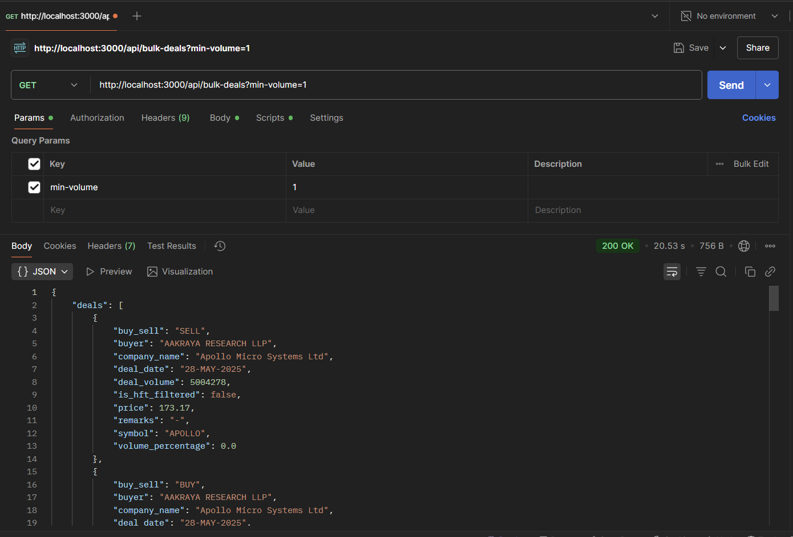
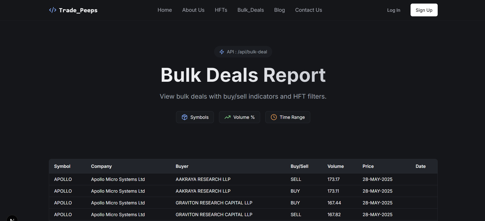

# TradePeeps 📈

> Advanced stock analysis and bulk deals tracking platform built with Next.js and Flask

## Features 🚀

- Real-time stock volume analysis
- NSE bulk deals tracking
- Qualification criteria based on trading volumes
- Interactive HTML reports
- Integration with NSE and yfinance data

## Tech Stack 💻

- **Frontend**: Next.js, TypeScript, Tailwind CSS
- **Backend**: Flask (Python)
- **Data Sources**: NSE API, yfinance
- **Deployment**: Vercel

## Getting Started 🏁

### Prerequisites

- Node.js (v14+)
- Python (v3.8+)
- npm or yarn

### Installation

1. Clone the repository

```bash
git clone https://github.com/Pa04rth/Trading_Peeps.git
cd Trading_Peeps
```

2. Install frontend dependencies

```bash
npm install
# or
yarn install
```

3. Install Python dependencies

```bash
cd api
pip install -r requirements.txt
```

4. Start the development servers

```bash
# Start Next.js frontend
npm run dev

# In another terminal, start Flask backend
npm run start-api
```

## API Documentation 📚

### Base URL

```
http://localhost:3000/
```

### Endpoints

#### GET `/api/bulk-deals`




Generates comprehensive stock analysis report including:

- Daily volume analysis
- Qualified symbols summary
- Bulk deals tracking

## Core Functions 🛠️

### Volume Analysis

```python
tradedVolumePerDayBatch(symbols_data, percentage=0.01)
```

- Analyzes trading volumes for multiple stocks
- Qualifies stocks based on volume thresholds
- Returns detailed per-day analysis

### Bulk Deals Processing

```python
fetchAllBulkDeals(daysInPast=30)
```

- Fetches and processes NSE bulk deals
- Configurable lookback period
- Automatic data formatting

## Report Sections 📊

1. **Volume Analysis Table**

   - Date-wise volumes
   - Outstanding shares comparison
   - Qualification indicators

2. **Qualified Symbols**

   - List of qualified stocks
   - Trading metrics
   - Qualification dates

3. **Bulk Deals**
   - Complete bulk deals list
   - Buy/Sell indicators
   - Transaction details

## Contributing 🤝

1. Fork the repository
2. Create your feature branch (`git checkout -b feature/AmazingFeature`)
3. Commit changes (`git commit -m 'Add AmazingFeature'`)
4. Push to branch (`git push origin feature/AmazingFeature`)
5. Open a Pull Request

## Environment Setup ⚙️

Create a `.env.local` file:

```env
NEXT_PUBLIC_API_URL=http://localhost:5328
```

## License 📄

Distributed under the MIT License. See `LICENSE` for more information.

## Contact 📧

Parth SOhaney - parthsohaney04@gmail.com

Project Link: [https://github.com/Pa04rth/Trading_Peeps](https://github.com/Pa04rth/Trading_Peeps)

---

Built with ❤️ by Parth Sohaney
